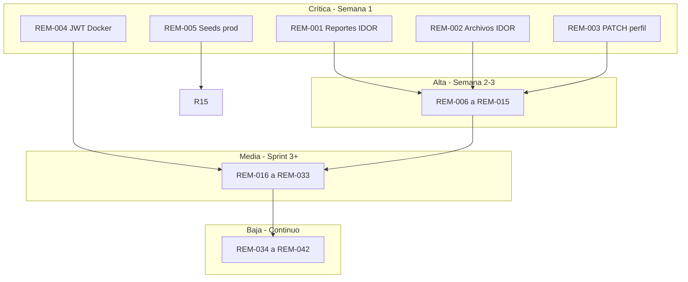

# Plan de Remediación OWASP — RimAI

**Fecha:** 11 de junio de 2026  
**Fuente:** [`docs/04_auditoria_owasp.md`](04_auditoria_owasp.md) (exclusivamente)  
**Objetivo:** Corregir los hallazgos documentados sin romper el funcionamiento existente del sistema (API dashboard productiva, capa hexagonal `/api/v1/*`, app Flutter, Docker de desarrollo).

**Principios de implementación segura**

1. **Reutilizar controles existentes** (`_autorizar_acceso_nino`, `verify_tutor_owns_patient`, handlers globales) en lugar de duplicar lógica.
2. **Cambios incrementales** con feature flags o perfiles Docker (`dev` / `prod`) donde un cambio estricto pueda afectar entornos locales.
3. **Tests de regresión** antes y después: `pytest backend/tests`, `flutter test`, y pruebas manuales de flujos tutor/terapeuta/admin documentados en seeds.
4. **Sin cambios de esquema DB** salvo donde el hallazgo lo exija explícitamente (p. ej. metadatos de ownership de archivos); preferir datos ya en `ninos.perfil_sensorial.documentos_clinicos`.

---

## Resumen por prioridad

| Prioridad | Ítems | Plazo sugerido |
|-----------|-------|----------------|
| **Crítica** | 5 | Inmediato (bloqueante producción) |
| **Alta** | 10 | 1–2 sprints |
| **Media** | 18 | 2–4 sprints |
| **Baja** | 7 | Backlog / hardening continuo |
| **Preventiva** | 1 | Al diseñar nuevas features |

**Total:** 41 ítems de remediación trazables a hallazgos H-Axx-xx.

---

## Fase 0 — Crítica (bloqueante para datos clínicos reales)

### REM-001 — H-A01-01: IDOR en reportes analíticos

| Campo | Detalle |
|-------|---------|
| **Prioridad** | **Crítica** |
| **Archivos** | `backend/app/adapters/inbound/api/reportes_controller.py`, `backend/app/adapters/inbound/api/seguimiento_controller.py` (alias legacy), módulo compartido de autorización (nuevo: p. ej. `backend/app/infrastructure/authorization.py` extrayendo lógica de `dashboard_controller.py`) |
| **Fix** | Antes de `reporte_uc.execute()`, invocar la misma regla que `_autorizar_acceso_nino`: terapeuta solo si `ninos.terapeuta_id` coincide; tutor solo si `ninos.tutor_id` coincide; admin permitido. Responder **403** (acceso denegado) o **404** (niño no encontrado) de forma consistente con el dashboard. |
| **Compatibilidad** | Extraer `_autorizar_acceso_nino` a módulo importable sin cambiar firmas de respuesta exitosas. Flutter ya llama reportes con token del tutor/terapeuta correcto; no cambia contrato JSON. |
| **Verificación** | (1) Tutor A con JWT → `GET /api/v1/reportes/{id_propio}` → **200**. (2) Tutor A → `{id ajeno}` → **403/404**. (3) Terapeuta asignado → **200**; terapeuta no asignado → **403/404**. (4) Tests pytest nuevos con mocks de usuario/niño. (5) Suite existente **28/28** sigue en verde. |

---

### REM-002 — H-A01-02: IDOR en descarga de documentos clínicos

| Campo | Detalle |
|-------|---------|
| **Prioridad** | **Crítica** |
| **Archivos** | `backend/app/adapters/inbound/api/dashboard_controller.py` (`descargar_documento_clinico`), `backend/app/adapters/outbound/storage/cloud_storage_adapter.py`, opcional consulta sobre `ninos.perfil_sensorial` |
| **Fix** | Resolver `filename` → `nino_id` consultando metadatos en BD (`documentos_clinicos` dentro de `perfil_sensorial`, donde ya se guarda `url` con el nombre UUID al subir en L2746–2749). Luego llamar autorización por niño antes de `FileResponse`. Si no hay mapping, **404** genérico. |
| **Compatibilidad** | URLs devueltas por upload (`/api/files/evaluations/{uuid}_...`) siguen siendo válidas para usuarios autorizados. No cambiar formato de URL en respuestas de subida. |
| **Verificación** | (1) Tutor dueño descarga su documento → **200** + contenido correcto. (2) Otro tutor autenticado con mismo `filename` → **403/404**. (3) Path traversal `../../etc/passwd` sigue bloqueado (`basename`). (4) Subida + descarga E2E desde dashboard familia intacta. |

---

### REM-003 — H-A01-03: PATCH perfil clínico sin autorización

| Campo | Detalle |
|-------|---------|
| **Prioridad** | **Crítica** |
| **Archivos** | `backend/app/adapters/inbound/api/dashboard_controller.py` (`actualizar_perfil_clinico`, ~L4505) |
| **Fix** | Llamar `_autorizar_acceso_nino(nino_id, current_user)` al inicio del handler. Restringir campos por rol: tutores editan subset; terapeutas editan campos clínicos completos; admin sin restricción adicional. |
| **Compatibilidad** | Mismos campos whitelist (`campos_permitidos`); solo se añade gate de acceso. Flujos terapeuta/tutor existentes del dashboard deben seguir funcionando. |
| **Verificación** | (1) Terapeuta asignado PATCH → **200**. (2) Usuario autenticado ajeno → **403**. (3) Tutor dueño PATCH campos permitidos → **200**. (4) Respuesta JSON `{ok, nino_id, estado_clinico}` sin cambios. |

---

### REM-004 — H-A02-01: JWT secret predecible en Docker Compose

| Campo | Detalle |
|-------|---------|
| **Prioridad** | **Crítica** |
| **Archivos** | `docker-compose.yml`, `.env.example`, documentación de despliegue |
| **Fix** | Eliminar fallback `${JWT_SECRET:-rimai-super-secret-key-2026}`. Usar `JWT_SECRET: ${JWT_SECRET:?JWT_SECRET es obligatorio}`. Documentar generación (`openssl rand -hex 32`) en `.env.example`. |
| **Compatibilidad** | Desarrollo local: obligar `.env` con secret (ya recomendado). CI ya define `JWT_SECRET` explícito en workflow. No altera formato de tokens ni login Flutter. |
| **Verificación** | (1) `docker compose up` sin `JWT_SECRET` en `.env` → contenedor API **no arranca** con mensaje claro. (2) Con `.env` válido → login **200** + token decodable. (3) Tokens emitidos antes del cambio de secret invalidados (comportamiento esperado tras rotación). |

---

### REM-005 — H-A02-03: Seeds demo con contraseñas conocidas en init Docker

| Campo | Detalle |
|-------|---------|
| **Prioridad** | **Crítica** |
| **Archivos** | `docker-compose.yml`, `backend/sql/02_seed.sql`, `backend/sql/05_seed_test.sql`, nuevo `docker-compose.override.yml` o perfil `dev` |
| **Fix** | Separar init DB: producción solo migraciones/esquema (`01_schema`); seeds demo montados **solo** en perfil `dev` (`docker compose --profile dev up`). Eliminar `RAISE NOTICE` con contraseñas en claro o sustituir por placeholder. En Railway/prod: no ejecutar seeds. |
| **Compatibilidad** | Desarrolladores conservan demo con `docker compose --profile dev`. Documentar credenciales demo solo en README de desarrollo, no en SQL de producción. |
| **Verificación** | (1) `docker compose up` (sin profile) → BD vacía o solo schema, sin `terapeuta@rimai.com`. (2) `--profile dev` → seed presente, login demo funciona. (3) Despliegue prod sin archivos seed en init. |

---

## Fase 1 — Alta

### REM-006 — H-A01-04: Historial y evaluaciones v1 sin ownership

| Campo | Detalle |
|-------|---------|
| **Prioridad** | **Alta** |
| **Archivos** | `backend/app/adapters/inbound/api/patient_controller.py`, `backend/app/application/usecases/patient_usecases.py`, `backend/app/application/usecases/evaluation_usecases.py` |
| **Fix** | Inyectar verificación de acceso en controller (reutilizar helper de REM-001) antes de `get_patient_history` y `upload_evaluation`. Pasar `current_user` al caso de uso si hace falta validación en dominio. |
| **Compatibilidad** | Endpoints y payloads sin cambio; solo nuevos **403** para accesos indebidos (comportamiento deseado). |
| **Verificación** | Tests: tutor dueño **200** en historial; tutor ajeno **403**; upload evaluación solo con ownership. |

---

### REM-007 — H-A01-05: Sync offline sin validar patient_id del tutor

| Campo | Detalle |
|-------|---------|
| **Prioridad** | **Alta** |
| **Archivos** | `backend/app/application/usecases/sincronizar_datos_usecase.py`, `backend/app/adapters/inbound/api/seguimiento_controller.py`, puerto/repositorio de pacientes o query en `PostgresPatientRepository` |
| **Fix** | Por cada `ActividadEjecutada`, verificar que `patient_id` pertenece al tutor (`padres_tutores.usuario_id = tutor_id`). Rechazar lote con **400** listando IDs inválidos, o omitir ítems inválidos según política (recomendado: fallar todo el lote para consistencia). |
| **Compatibilidad** | Flutter sync legítimo envía IDs de sus niños; sin cambio de contrato. Endpoint deprecado `/sincronizar` y flujo `/api/sesiones` deben alinearse si ambos coexisten. |
| **Verificación** | (1) Sync con patient_id propio → **200**. (2) Sync con patient_id ajeno → **400/403**. (3) `synced_count` correcto en caso válido. |

---

### REM-008 — H-A01-06: Plan personalizado sin rol ni asignación

| Campo | Detalle |
|-------|---------|
| **Prioridad** | **Alta** |
| **Archivos** | `backend/app/adapters/inbound/api/plan_controller.py` |
| **Fix** | Exigir `current_user["role"] == "terapeuta"`. Verificar asignación terapeuta–paciente vía query (mismo criterio que `_autorizar_acceso_nino`). |
| **Compatibilidad** | `validar_plan` ya exige terapeuta; alinear `personalizar` con mismo patrón. |
| **Verificación** | Terapeuta asignado POST `/api/v1/planes/personalizar` → **200**; padre_tutor → **403**; terapeuta no asignado → **403**. |

---

### REM-009 — H-A01-07: Rol arbitrario al crear usuarios (admin)

| Campo | Detalle |
|-------|---------|
| **Prioridad** | **Alta** |
| **Archivos** | `backend/app/adapters/inbound/api/admin_controller.py`, `backend/app/domain/entities/user.py` (`RoleEnum`) |
| **Fix** | Cambiar `rol: str` → `rol: RoleEnum` en `UsuarioCreateRequest`. Opcional: requerir confirmación o segundo admin para crear rol `admin` (log de auditoría mínimo). |
| **Compatibilidad** | Valores válidos actuales (`terapeuta`, `padre_tutor`, `admin`) siguen aceptados; strings inválidos pasan a **422** Pydantic en lugar de insertarse. |
| **Verificación** | POST `/api/admin/usuarios` con `rol: "superuser"` → **422**; con `rol: "terapeuta"` → **201**; panel admin existente sin rotura. |

---

### REM-010 — H-A02-02: Credenciales embebidas en config.py

| Campo | Detalle |
|-------|---------|
| **Prioridad** | **Alta** |
| **Archivos** | `backend/app/infrastructure/config.py`, `backend/tests/conftest.py` |
| **Fix** | Mover `_DEFAULT_JWT_SECRET` y `_DEFAULT_DATABASE_URL` a `conftest.py` o variables de entorno exclusivas de pytest. En `config.py`, `_require()` sin defaults en código para producción. |
| **Compatibilidad** | CI ya usa `RIMAI_ALLOW_TEST_DEFAULTS=1`; mantener flag solo en tests. `init_db_pool()` en dev sigue requiriendo `.env`. |
| **Verificación** | `grep` en `backend/app/` no encuentra cadenas de contraseña. `pytest` pasa con conftest. App prod sin flag test exige env vars. |

---

### REM-011 — H-A04-02 / H-A07-01: Rate limiting en login y registro

| Campo | Detalle |
|-------|---------|
| **Prioridad** | **Alta** |
| **Archivos** | `backend/app/main.py`, nuevo `backend/app/infrastructure/rate_limit.py`, `backend/app/adapters/inbound/api/auth_controller.py`, `backend/requirements.txt` (p. ej. `slowapi`) |
| **Fix** | Límite por IP: login **5/min**, registro **3/hora** (ajustables por env). Responder **429** con `Retry-After`. Excluir health checks. |
| **Compatibilidad** | Límites generosos en `RIMAI_ALLOW_TEST_DEFAULTS=1` para CI. Usuario legítimo no afectado en uso normal. |
| **Verificación** | (1) 6º login fallido en 1 min → **429**. (2) Login exitoso tras espera → **200**. (3) Tests CI con límite deshabilitado o elevado. |

---

### REM-012 — H-A05-01: CORS sin fallback permisivo en producción

| Campo | Detalle |
|-------|---------|
| **Prioridad** | **Alta** |
| **Archivos** | `backend/app/infrastructure/config.py`, `.env.example`, `docker-compose.yml` |
| **Fix** | Si `CORS_ORIGINS` vacío y **no** `_TEST_DEFAULTS_ALLOWED` → `RuntimeError` al arrancar. Solo en test/dev usar lista localhost. |
| **Compatibilidad** | Railway y Docker deben definir `CORS_ORIGINS` explícito (ya documentado en compose). Flutter web/emulador: incluir orígenes necesarios en `.env`. |
| **Verificación** | (1) Prod sin `CORS_ORIGINS` → fallo startup. (2) App Flutter desde origen listado → requests OK. (3) Origen no listado → bloqueado por browser. |

---

### REM-013 — H-A05-07: Fuga de excepciones en admin_controller

| Campo | Detalle |
|-------|---------|
| **Prioridad** | **Alta** |
| **Archivos** | `backend/app/adapters/inbound/api/admin_controller.py` (L85–86, L117, L178, L218, L271) |
| **Fix** | Sustituir `detail=f"... {str(e)}"` por mensaje genérico + `logger.exception(...)` en cada bloque `except Exception`. Alinear con `exception_handlers.py`. |
| **Compatibilidad** | Códigos HTTP sin cambio; solo `detail` al cliente. Admin UI debe seguir mostrando errores genéricos. |
| **Verificación** | Simular error DB en listar usuarios → cliente recibe mensaje sin stack/SQL; logs server contienen traza completa. |

---

### REM-014 — H-A04-01: Registro público sin verificación

| Campo | Detalle |
|-------|---------|
| **Prioridad** | **Alta** |
| **Archivos** | `backend/app/adapters/inbound/api/auth_controller.py`, `backend/app/application/usecases/auth_usecases.py`, `backend/app/infrastructure/config.py` |
| **Fix** | Variable `ALLOW_PUBLIC_REGISTER` (default `true` en dev, `false` en prod). Si `false`, POST `/register` → **403** con mensaje de invitación requerida. Fase 2: flujo invitación (fuera de alcance mínimo). |
| **Compatibilidad** | Dev/demo mantiene registro abierto. Prod desactiva sin eliminar endpoint. Flutter registro existente funciona en dev. |
| **Verificación** | (1) `ALLOW_PUBLIC_REGISTER=false` → register **403**. (2) `true` → registro + login auto intacto. (3) Login no afectado. |

---

### REM-015 — H-A05-04: PostgreSQL y pgAdmin expuestos (Docker)

| Campo | Detalle |
|-------|---------|
| **Prioridad** | **Alta** (entorno dev); **Crítica** si compose se usa en prod |
| **Archivos** | `docker-compose.yml`, nuevo `docker-compose.prod.yml` |
| **Fix** | En compose prod: eliminar `ports` de `db` y `pgadmin`; solo red interna `rimai_net`. Dev mantiene puertos en override. `PGADMIN_CONFIG_MASTER_PASSWORD_REQUIRED: "True"`. |
| **Compatibilidad** | API se conecta a `db:5432` interno sin cambio. Desarrollo local sin override sigue exponiendo puertos. |
| **Verificación** | Prod compose: `nmap localhost` no muestra 5432/5050. API health **200**. pgAdmin accesible solo vía túnel si se necesita. |

---

## Fase 2 — Media

### REM-016 — H-A02-04: JWT de 7 días

| Campo | Detalle |
|-------|---------|
| **Prioridad** | **Media** |
| **Archivos** | `backend/app/application/usecases/auth_usecases.py`, `backend/app/infrastructure/config.py`, `rimai_app/lib/infrastructure/config/auth_storage_service.dart` |
| **Fix** | Reducir access token a **60 min** vía env `ACCESS_TOKEN_EXPIRE_MINUTES`. Mantener re-login en Flutter (ya verifica expiración L88–90). Fase posterior: refresh token (REM-017 relacionado). |
| **Compatibilidad** | Implementar en dos pasos: primero 24 h, luego 60 min tras validar UX. Documentar en release notes. |
| **Verificación** | Token emitido expira según TTL; Flutter redirige a login; sesión activa < TTL sin interrupciones. |

---

### REM-017 — H-A07-02: Sin revocación server-side de tokens

| Campo | Detalle |
|-------|---------|
| **Prioridad** | **Media** |
| **Archivos** | `auth_usecases.py`, `auth_controller.py`, `dependencies.py`, opcional tabla `token_revocations` o Redis |
| **Fix** | Endpoint POST `/api/v1/auth/logout` que registra `jti` o hash de token hasta `exp`. En `get_current_user`, rechazar tokens revocados. Opcional: refresh token HttpOnly. |
| **Compatibilidad** | Tokens actuales sin `jti` siguen válidos hasta expiración natural. Añadir `jti` en nuevos tokens sin romper decode si se hace opcional. |
| **Verificación** | Logout → mismo token → **401**; token nuevo → **200** en `/me`. |

---

### REM-018 — H-A02-05: Algoritmo JWT configurable sin whitelist

| Campo | Detalle |
|-------|---------|
| **Prioridad** | **Media** |
| **Archivos** | `backend/app/infrastructure/config.py`, `backend/app/adapters/inbound/api/dependencies.py`, `auth_usecases.py` |
| **Fix** | Constante `JWT_ALGORITHMS = ["HS256"]`; eliminar o ignorar `JWT_ALGORITHM` env en decode/encode. |
| **Compatibilidad** | Tokens HS256 existentes siguen válidos. |
| **Verificación** | Login + decode OK; env `JWT_ALGORITHM=none` no afecta comportamiento. |

---

### REM-019 — H-A04-03: Upload sin validación MIME/tamaño

| Campo | Detalle |
|-------|---------|
| **Prioridad** | **Media** |
| **Archivos** | `backend/app/adapters/outbound/storage/cloud_storage_adapter.py`, `patient_controller.py`, `dashboard_controller.py` (subir documento) |
| **Fix** | Whitelist MIME (`application/pdf`, `image/jpeg`, `image/png`). Tamaño máx **10 MB** acumulado por stream. **413** si excede; **415** si MIME inválido. |
| **Compatibilidad** | Tipos ya usados en app (PDF, imágenes) permitidos. Mensaje claro si usuario sube tipo no soportado. |
| **Verificación** | PDF 5 MB → OK; `.exe` → **415**; 15 MB → **413**; flujo subida dashboard familia con PDF demo OK. |

---

### REM-020 — H-A04-04: Sin política de contraseña

| Campo | Detalle |
|-------|---------|
| **Prioridad** | **Media** |
| **Archivos** | `auth_controller.py`, `admin_controller.py`, validador compartido en `backend/app/domain/validators/password.py` |
| **Fix** | Pydantic validator: mínimo 12 caracteres, al menos 1 mayúscula, 1 minúscula, 1 dígito. Aplicar en `RegisterRequest`, `LoginRequest` (solo formato email), `UsuarioCreateRequest`, `TherapistCreateRequest`. |
| **Compatibilidad** | Cuentas demo en dev pueden actualizarse en seeds. Migración: no forzar cambio en login existente; solo en registro/cambio password. |
| **Verificación** | Password `123` → **422**; password compleja → **201/200**. Admin crear terapeuta con password débil → **422**. |

---

### REM-021 — H-A04-05: Endpoint IA sin restricción de rol

| Campo | Detalle |
|-------|---------|
| **Prioridad** | **Media** |
| **Archivos** | `backend/app/adapters/inbound/api/ai_controller.py` |
| **Fix** | Permitir roles `terapeuta`, `admin`, `padre_tutor` (según negocio); denegar otros. Rate limit **30/hora** por usuario. |
| **Compatibilidad** | Flujos actuales que usen IA desde app mantienen roles permitidos. |
| **Verificación** | Terapeuta → **200**; rol inválido → **403**; exceso de requests → **429**. |

---

### REM-022 — H-A05-02: CORS métodos y headers permisivos

| Campo | Detalle |
|-------|---------|
| **Prioridad** | **Media** |
| **Archivos** | `backend/app/main.py` |
| **Fix** | `allow_methods=["GET","POST","PUT","PATCH","DELETE","OPTIONS"]`, `allow_headers=["Authorization","Content-Type","Accept"]`. |
| **Compatibilidad** | Flutter/Dio usa Authorization + Content-Type; verificar preflight desde app. |
| **Verificación** | App completa (login, sync, dashboard) sin errores CORS; OPTIONS preflight OK. |

---

### REM-023 — H-A06-01: Sin escaneo CVE en CI

| Campo | Detalle |
|-------|---------|
| **Prioridad** | **Media** |
| **Archivos** | `.github/workflows/build-apk.yml`, nuevo `.github/dependabot.yml` |
| **Fix** | Job `pip-audit -r backend/requirements.txt` (fallo en críticas). Dependabot semanal para pip y pub. |
| **Compatibilidad** | Pipeline falla solo en CVE críticas/altas configurables; no bloquea por informativas. |
| **Verificación** | PR ejecuta pip-audit; Dependabot abre PRs de bump; build APK sigue tras deps limpias. |

---

### REM-024 — H-A06-02: pytest en dependencias runtime

| Campo | Detalle |
|-------|---------|
| **Prioridad** | **Media** |
| **Archivos** | `backend/requirements.txt`, nuevo `backend/requirements-dev.txt`, `backend/Dockerfile`, CI workflow |
| **Fix** | Mover `pytest` a dev. Dockerfile prod instala solo `requirements.txt`. CI: `pip install -r requirements-dev.txt`. |
| **Compatibilidad** | Imagen Docker prod más ligera; tests sin cambio. |
| **Verificación** | `docker build` no incluye pytest; CI instala dev deps y pytest pasa. |

---

### REM-025 — H-A06-03: python-jose mantenimiento limitado

| Campo | Detalle |
|-------|---------|
| **Prioridad** | **Media** |
| **Archivos** | `auth_usecases.py`, `dependencies.py`, `requirements.txt` |
| **Fix** | Migrar a `PyJWT` con API equivalente (`encode`/`decode`, `algorithms=["HS256"]`). |
| **Compatibilidad** | Mismo secret y claims (`sub`, `role`, `id`, `exp`); tokens emitidos antes de migración invalidados si cambia librería (planificar ventana de mantenimiento o dual decode temporal). |
| **Verificación** | Login emite token; `/me` **200**; tests auth pasan. |

---

### REM-026 — H-A06-04: Imagen pgAdmin `:latest`

| Campo | Detalle |
|-------|---------|
| **Prioridad** | **Media** |
| **Archivos** | `docker-compose.yml` |
| **Fix** | Pin `dpage/pgadmin4:8.14` (o versión verificada al implementar). |
| **Compatibilidad** | Solo dev; sin impacto en API. |
| **Verificación** | `docker compose pull` usa tag fijo; pgAdmin arranca. |

---

### REM-027 — H-A06-05: Dependencias no usadas (sqlalchemy, asyncpg)

| Campo | Detalle |
|-------|---------|
| **Prioridad** | **Media** |
| **Archivos** | `backend/requirements.txt` |
| **Fix** | Eliminar tras confirmar cero imports en `backend/app/`. |
| **Compatibilidad** | Sin cambio funcional si realmente no se usan. |
| **Verificación** | `grep -r sqlalchemy backend/app` vacío; pytest pasa; Docker build OK. |

---

### REM-028 — H-A08-01: joblib.load sin verificación de integridad

| Campo | Detalle |
|-------|---------|
| **Prioridad** | **Media** |
| **Archivos** | `backend/app/application/usecases/ai_support_usecases.py`, `backend/app/ai/models/`, script de generación de hash |
| **Fix** | Al build, generar `rf_support_level.pkl.sha256`. En `_load_model`, verificar hash antes de `joblib.load`; si falla, usar heurística fallback (ya existente L34–43). Permisos de archivo `0440`. |
| **Compatibilidad** | Si hash no existe (dev), log warning y fallback heurístico (comportamiento actual). |
| **Verificación** | Modelo íntegro → predicción ML; archivo corrupto → fallback sin crash; permisos restrictivos en disco. |

---

### REM-029 — H-A07-03: Email sin EmailStr en auth requests

| Campo | Detalle |
|-------|---------|
| **Prioridad** | **Media** |
| **Archivos** | `backend/app/adapters/inbound/api/auth_controller.py` |
| **Fix** | `email: EmailStr` en `LoginRequest` y `RegisterRequest`. |
| **Compatibilidad** | Emails válidos actuales siguen OK; strings mal formados → **422** (antes podían fallar en capa inferior). |
| **Verificación** | Login `not-an-email` → **422**; `user@rimai.com` → flujo normal. |

---

### REM-030 — H-A09-02: Sin log de intentos de login fallidos

| Campo | Detalle |
|-------|---------|
| **Prioridad** | **Media** |
| **Archivos** | `auth_usecases.py` o `auth_controller.py`, reutilizar `PostgresAuditoriaRepository` o log estructurado |
| **Fix** | En login fallido: log con email normalizado (no password), IP (`Request.client`), timestamp, resultado. Sin bloquear login legítimo. |
| **Compatibilidad** | Solo añade logging; respuesta **401** idéntica. |
| **Verificación** | Login fallido genera entrada en logs/`logs_auditoria`; exitoso no registra fallo. |

---

### REM-031 — H-A09-03: Auditoría parcial

| Campo | Detalle |
|-------|---------|
| **Prioridad** | **Media** |
| **Archivos** | `reportes_controller.py`, helper `_registrar_auditoria`, `PostgresAuditoriaRepository` |
| **Fix** | Registrar lectura de reporte (`REPORTE_LEIDO`) y accesos denegados (`ACCESO_DENEGADO`) con usuario, entidad, IP. |
| **Compatibilidad** | Solo INSERT adicional; respuestas API sin cambio. |
| **Verificación** | GET reporte autorizado → fila auditoría; acceso denegado → fila con acción de seguridad. |

---

### REM-032 — H-A05-05: Montaje código en contenedor API

| Campo | Detalle |
|-------|---------|
| **Prioridad** | **Media** |
| **Archivos** | `docker-compose.yml`, `docker-compose.prod.yml` |
| **Fix** | Volumen `./backend:/app` solo en override dev. Prod usa imagen inmutable del Dockerfile. |
| **Compatibilidad** | Dev hot-reload conservado en override. |
| **Verificación** | Prod container sin bind mount; cambio local no afecta prod hasta rebuild. |

---

### REM-033 — H-A08-02: requirements.txt sin lockfile

| Campo | Detalle |
|-------|---------|
| **Prioridad** | **Media** |
| **Archivos** | `backend/requirements.txt`, nuevo `backend/requirements.lock`, CI |
| **Fix** | Generar lock con `pip-compile`; CI instala desde lock en prod build. |
| **Compatibilidad** | Mismas versiones pinneadas; builds reproducibles. |
| **Verificación** | Dos builds consecutivos producen misma imagen hash; tests OK. |

---

## Fase 3 — Baja (hardening)

### REM-034 — H-A05-03: OpenAPI/Swagger expuesto

| Campo | Detalle |
|-------|---------|
| **Prioridad** | **Baja** |
| **Archivos** | `backend/app/main.py`, `config.py` |
| **Fix** | Si `ENV=production`: `docs_url=None`, `redoc_url=None`, `openapi_url=None`. Dev mantiene `/docs`. |
| **Compatibilidad** | Desarrollo sin cambio; prod oculta documentación interactiva. |
| **Verificación** | Prod: `/docs` → **404**; dev: `/docs` → **200**. |

---

### REM-035 — H-A05-06: Sin cabeceras de seguridad HTTP

| Campo | Detalle |
|-------|---------|
| **Prioridad** | **Baja** |
| **Archivos** | `backend/app/main.py`, middleware nuevo |
| **Fix** | Middleware añade `X-Content-Type-Options: nosniff`, `X-Frame-Options: DENY`, `Referrer-Policy: strict-origin-when-cross-origin`. HSTS solo detrás de HTTPS (Railway). |
| **Compatibilidad** | API JSON sin iframe; Flutter no afectado. |
| **Verificación** | `curl -I` muestra headers; app Flutter funciona. |

---

### REM-036 — H-A09-01: Sin APM/SIEM

| Campo | Detalle |
|-------|---------|
| **Prioridad** | **Baja** |
| **Archivos** | `backend/app/main.py`, `requirements.txt`, variables de entorno |
| **Fix** | Integración opcional Sentry (`SENTRY_DSN`); si ausente, no-op. |
| **Compatibilidad** | Sin DSN = cero overhead. |
| **Verificación** | Con DSN, excepción 500 aparece en Sentry; sin DSN, app normal. |

---

### REM-037 — H-A09-05: Validación expone exc.errors() completos

| Campo | Detalle |
|-------|---------|
| **Prioridad** | **Baja** |
| **Archivos** | `backend/app/adapters/inbound/api/exception_handlers.py` |
| **Fix** | En prod, devolver solo `{campo: mensaje}` sin `ctx`/`url` internos de Pydantic. |
| **Compatibilidad** | Clientes Flutter que parsean `errors` siguen recibiendo lista simplificada. |
| **Verificación** | POST inválido → **422** con errores legibles sin metadatos internos. |

---

### REM-038 — H-A07-04: Token asumido válido offline (Flutter)

| Campo | Detalle |
|-------|---------|
| **Prioridad** | **Baja** |
| **Archivos** | `rimai_app/lib/infrastructure/config/auth_storage_service.dart` |
| **Fix** | Al recuperar conectividad (`connectivity_plus`), llamar `isTokenValidOnServer()`. Documentar trade-off offline en comentario/README app. |
| **Compatibilidad** | Offline sigue funcionando; revalidación en background al volver red. |
| **Verificación** | Token revocado + red → logout en próxima conectividad; offline sin red → sesión local mantenida. |

---

### REM-039 — H-A08-03: Sin certificate pinning (Flutter)

| Campo | Detalle |
|-------|---------|
| **Prioridad** | **Baja** |
| **Archivos** | `rimai_app/lib/core/constants/api_constants.dart`, capa Dio/http |
| **Fix** | Evaluar pinning solo release prod con hash del cert Railway; feature flag `ENABLE_CERT_PINNING`. |
| **Compatibilidad** | Pinning deshabilitado en dev/debug. Rotación cert requiere update app (documentar). |
| **Verificación** | MITM con proxy en dev (pinning off) OK; prod con pinning rechaza cert falso. |

---

### REM-040 — H-A08-04: CI APK sin documentación de firma

| Campo | Detalle |
|-------|---------|
| **Prioridad** | **Baja** |
| **Archivos** | `.github/workflows/build-apk.yml`, `rimai_app/README.md` o `docs/deploy.md` |
| **Fix** | Documentar keystore en GitHub Secrets; opcional step `flutter build apk --release` con `--obfuscate` y firma. |
| **Compatibilidad** | CI actual sin secrets sigue generando APK debug/release unsigned para artefactos. |
| **Verificación** | Documento describe pasos; build CI no rompe sin secrets opcionales. |

---

### REM-041 — H-A03-01: SQL dinámico con f-string (riesgo residual)

| Campo | Detalle |
|-------|---------|
| **Prioridad** | **Baja** |
| **Archivos** | `dashboard_controller.py` (`actualizar_perfil_clinico`) |
| **Fix** | Reemplazar construcción dinámica por ramas `if key == ...` con statements estáticos, o dict predefinido columna→fragmento SQL. Mantener whitelist. |
| **Compatibilidad** | Mismos campos actualizables; misma respuesta. |
| **Verificación** | PATCH perfil con cada campo permitido → **200**; intento inyección en nombre de campo ignorado. |

---

## Fase 4 — Preventiva (sin hallazgo actual)

### REM-042 — H-A10: Guía SSRF para desarrollo futuro

| Campo | Detalle |
|-------|---------|
| **Prioridad** | **Baja** (preventiva) |
| **Archivos** | `docs/security/ssrf-guidelines.md` (nuevo, al implementar webhooks) |
| **Fix** | Documentar whitelist de hosts, bloqueo RFC1918, timeouts, prohibición de redirects a IPs internas. |
| **Compatibilidad** | N/A — sin código hasta nueva feature. |
| **Verificación** | Checklist en PR template para endpoints que fetcheen URLs externas. |

---

## Orden de ejecución recomendado (sin romper el sistema)

**Secuencia crítica detallada**

1. **REM-004 + REM-010** primero (secretos): preparar `.env` en todos los entornos antes de rotar JWT.
2. **REM-001, REM-002, REM-003** en paralelo (extraer módulo autorización compartido una sola vez).
3. **REM-005** (seeds) independiente del código API.
4. Ejecutar **pytest + flutter test** tras cada REM crítico.
5. **REM-016** (TTL JWT) solo después de REM-004 y validación UX Flutter.

---

## Criterios globales de aceptación del plan

| Criterio | Umbral |
|----------|--------|
| Regresión tests backend | 100 % tests existentes pasan |
| Regresión tests Flutter | 100 % tests existentes pasan |
| IDOR críticos (REM-001–003) | 0 accesos cruzados en pruebas con 2 tutores + 1 terapeuta |
| Secretos en repo app | 0 passwords/JWT defaults en `backend/app/` y `docker-compose.yml` prod |
| Login/registro | Flujos demo dev operativos con `.env` y profile `dev` |
| Dashboard productivo | Rutas `/api/dashboard/*` usadas por Flutter sin cambio de contrato JSON |

---

## Trazabilidad auditoría → remediación

| Hallazgo | REM |
|----------|-----|
| H-A01-01 | REM-001 |
| H-A01-02 | REM-002 |
| H-A01-03 | REM-003 |
| H-A01-04 | REM-006 |
| H-A01-05 | REM-007 |
| H-A01-06 | REM-008 |
| H-A01-07 | REM-009 |
| H-A02-01 | REM-004 |
| H-A02-02 | REM-010 |
| H-A02-03 | REM-005 |
| H-A02-04 | REM-016 |
| H-A02-05 | REM-018 |
| H-A03-01 | REM-041 |
| H-A03-02 | REM-002 (path) + REM-002 |
| H-A04-01 | REM-014 |
| H-A04-02 | REM-011 |
| H-A04-03 | REM-019 |
| H-A04-04 | REM-020 |
| H-A04-05 | REM-021 |
| H-A05-01 | REM-012 |
| H-A05-02 | REM-022 |
| H-A05-03 | REM-034 |
| H-A05-04 | REM-015 |
| H-A05-05 | REM-032 |
| H-A05-06 | REM-035 |
| H-A05-07 | REM-013 |
| H-A06-01 | REM-023 |
| H-A06-02 | REM-024 |
| H-A06-03 | REM-025 |
| H-A06-04 | REM-026 |
| H-A06-05 | REM-027 |
| H-A07-01 | REM-011 |
| H-A07-02 | REM-017 |
| H-A07-03 | REM-029 |
| H-A07-04 | REM-038 |
| H-A08-01 | REM-028 |
| H-A08-02 | REM-033 |
| H-A08-03 | REM-039 |
| H-A08-04 | REM-040 |
| H-A09-01 | REM-036 |
| H-A09-02 | REM-030 |
| H-A09-03 | REM-031 |
| H-A09-04 | Cubierto por REM-013 (admin alinea con handlers globales) |
| H-A09-05 | REM-037 |
| H-A10 | REM-042 |

---

*Plan derivado exclusivamente de [`docs/04_auditoria_owasp.md`](04_auditoria_owasp.md). Implementar en ramas pequeñas por REM con revisión de seguridad y QA antes de merge a `develop`.*
