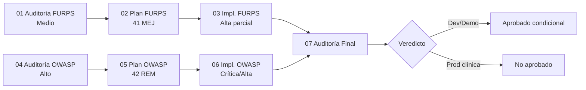

# Auditoría Final Integral — RimAI

**Fecha:** 11 de junio de 2026  
**Alcance:** Dictamen consolidado de calidad (FURPS+) y seguridad (OWASP Top 10)  
**Fuentes:**

| Documento | Rol |
|-----------|-----|
| [`docs/03_auditoria_implementacion_furps.md`](03_auditoria_implementacion_furps.md) | Implementación plan FURPS (MEJ-001–041) |
| [`docs/06_auditoria_implementacion_owasp.md`](06_auditoria_implementacion_owasp.md) | Implementación plan OWASP (REM-001–042) |
| [`docs/02_plan_furps.md`](02_plan_furps.md) | Criterios de verificación y checklist de release |
| [`docs/05_plan_owasp.md`](05_plan_owasp.md) | Criterios globales de aceptación seguridad |
| [`docs/04_auditoria_owasp.md`](04_auditoria_owasp.md) | Línea base de riesgo pre-remediación |

**Verificación en código (11/06/2026):** `pytest backend/tests` → **36/36** · `flutter test` → **3/3** · módulos `authorization.py`, `rate_limit.py`, `docker-compose.prod.yml` presentes.

---

## 1. Resumen ejecutivo

RimAI ha recorrido un ciclo **auditoría → plan → implementación parcial** en dos frentes: calidad arquitectónica (FURPS+) y seguridad (OWASP). El avance es **real y medible**, pero **incompleto** respecto a los planes maestros.

| Dimensión | Nivel inicial (aud. 01/04) | Nivel actual | Tendencia |
|-----------|----------------------------|--------------|-----------|
| **Calidad FURPS+ global** | Medio | **Medio** | ↑ leve (infra, SCQ, pool, CI) |
| **Seguridad OWASP global** | Alto | **Medio-Alto** | ↑↑ (IDOR críticos mitigados) |
| **Cobertura plan FURPS** | — | **29 %** (12/41 con avance) | Fase Alta abordada |
| **Cobertura plan OWASP** | — | **40 %** (17/42 con avance) | Crítica/Alta abordada |

---

## 2. Estado de calidad — FURPS+

### 2.1 Resumen por dimensión

| Dimensión | Nivel actual | Evidencia clave | vs. auditoría 03 |
|-----------|--------------|-----------------|------------------|
| **Functionality** | **Medio+** | Repos PostgreSQL hexagonales reales; SCQ unificado (`EvaluarCuestionarioSCQUseCase`); URL reportes corregida en Flutter; flujo productivo sigue en `dashboard_controller.py` (~5 600+ líneas) | Sin cambio de calificación; avance en P1 parcial |
| **Usability** | **Medio** | Tema PMV2, navegación por rol; placeholders, login social y recuperar contraseña sin implementar (MEJ-016–018 **No**) | Sin cambio |
| **Reliability** | **Medio+** | Handlers globales (MEJ-008 **Sí**); pool DB (MEJ-010 parcial); CORS endurecido post-OWASP (`config.py` L51–60); sync Flutter silencioso en errores (MEJ-014 **No**) | Mejora por REM-012 |
| **Performance** | **Medio+** | Alertas fuera de GET resumen (MEJ-009 **Sí**); N+1 en resumen terapeuta persiste (MEJ-013 **No**) | Sin cambio |
| **Supportability** | **Medio+** | CI con tests backend+Flutter (MEJ-012 parcial); 36 tests backend (+8 seguridad); monolito dashboard; README incompleto (MEJ-030 **No**) | Tests ampliados |

### 2.2 Implementación plan FURPS (MEJ-001–041)

| Fase | Sí | Parcial | No |
|------|-----|---------|-----|
| Alta (12) | 4 | 8 | 0 |
| Media (18) | 0 | 0 | 18 |
| Baja (11) | 0 | 0 | 11 |

**Ítems Alta cerrados (Sí):** MEJ-001, MEJ-007, MEJ-008, MEJ-009, MEJ-011.

**Parcialidades Alta relevantes:** MEJ-002/003/004 (secretos/CORS — parcialmente mejoradas por OWASP REM-004/010/012), MEJ-005 (sync no unificado), MEJ-006 (repos sin integración), MEJ-010 (pool sin prueba carga), MEJ-012 (CI sin PostgreSQL).

**Fases Media y Baja:** sin implementación (70 % del plan FURPS pendiente).

### 2.3 Calificación FURPS+

**MEDIO** — Apto para **desarrollo, demo y pruebas funcionales**; no cumple criterios de madurez para producción clínica sostenida (monolito, tests integración, fase Media sin iniciar).

---

## 3. Estado de seguridad — OWASP Top 10

### 3.1 Resumen por categoría (post-remediación Crítica/Alta)

| Categoría | Antes (aud. 04) | Ahora | Cambio principal |
|-----------|-----------------|-------|------------------|
| **A01 Broken Access Control** | Alto | **Medio** | `authorization.py`; IDOR reportes/archivos/perfil cerrados |
| **A02 Cryptographic Failures** | Alto | **Medio** | JWT/CORS obligatorios en Docker; JWT 7 días y defaults test pendientes |
| **A03 Injection** | Bajo | **Bajo** | SQL parametrizado; whitelist en PATCH perfil |
| **A04 Insecure Design** | Alto | **Medio-Alto** | Rate limit auth; `ALLOW_PUBLIC_REGISTER`; uploads/password sin política |
| **A05 Security Misconfiguration** | Alto | **Medio** | CORS/admin OK; compose base expone 5432; Swagger abierto |
| **A06 Vulnerable Components** | Medio | **Medio** | pgAdmin pinneado; sin pip-audit |
| **A07 Auth Failures** | Medio | **Medio** | Rate limit parcial; sin revocación JWT |
| **A08 Integrity Failures** | Medio | **Medio** | Sin lockfile pip; joblib sin hash |
| **A09 Logging/Monitoring** | Medio | **Medio** | Admin sanitizado; sin SIEM ni audit lecturas |
| **A10 SSRF** | Sin evidencia | **Sin evidencia** | — |

### 3.2 Implementación plan OWASP (REM-001–042)

| Fase | Sí | Parcial | No |
|------|-----|---------|-----|
| Crítica (5) | 3 | 2 | 0 |
| Alta (10) | 4 | 6 | 0 |
| Media (18) | 2* | 1 | 15 |
| Baja (8) | 0 | 0 | 8 |
| Preventiva (1) | 0 | 0 | 1 |

\*REM-018 (HS256 fijo) y REM-026 (pgAdmin 8.14) adelantados.

### 3.3 Calificación seguridad

**MEDIO-ALTO** — Mejora sustancial respecto al **Alto** inicial; **no** alcanza umbral de producción con datos clínicos reales de menores sin cerrar parcialidades y fase Media.

---

## 4. Hallazgos críticos pendientes

Hallazgos que **bloquean** la aprobación para producción clínica (prioridad P0/P1 unificada):

| ID | Origen | Hallazgo | Evidencia actual | Impacto |
|----|--------|----------|------------------|---------|
| **C-01** | REM-002 | Descarga de documentos clínicos: resolución por scan BD; archivos huérfanos sin metadatos | `authorization.py` L95–124; sin E2E | Acceso denegado legítimo o bypass si metadatos incompletos |
| **C-02** | REM-005 / MEJ-003 | Seeds demo con credenciales en repo; compose dev expone 5432 | `05_seed_test.sql` L7–10; `docker-compose.yml` L19–21 | Compromiso de entorno si se confunde dev con prod |
| **C-03** | REM-006 | `POST /api/v1/perfiles/` sin restricción de rol | `patient_controller.py` L10–12 | Cualquier JWT puede registrar pacientes |
| **C-04** | REM-016 | JWT 7 días, sin revocación | `auth_usecases.py` L10 | Ventana amplia de abuso si token filtrado |
| **C-05** | REM-019 | Uploads sin límite MIME/tamaño | `cloud_storage_adapter.py` L27–35 | DoS disco / malware almacenado |
| **C-06** | MEJ-006 / H-03 | Sin tests de integración PostgreSQL en CI | `.github/workflows/build-apk.yml`; 36 tests unitarios | Regresiones de persistencia no detectadas |
| **C-07** | MEJ-020 / T-01 | Monolito `dashboard_controller.py` con lógica productiva concentrada | ~5 600+ líneas; autorización no uniforme en todos los endpoints | Deuda de control de acceso y mantenimiento |
| **C-08** | REM-015 | Compose por defecto publica PostgreSQL | `docker-compose.yml` L19–21 | Exposición de BD en despliegue incorrecto |

**Nota:** Los IDOR **críticos originales** (reportes, PATCH perfil, descarga con auth) están **mitigados** (REM-001/003 **Sí**; REM-002 **Parcial**). C-01 es residual de REM-002, no reapertura del hallazgo P0 original.

---

## 5. Riesgos residuales documentados

### 5.1 Seguridad

| Riesgo | Severidad | Estado |
|--------|-----------|--------|
| JWT 7 días + sin logout server-side | Media | Abierto (REM-016/017) |
| `create_patient` v1 abierto a cualquier rol autenticado | Media | Abierto (REM-006) |
| Endpoint IA sin restricción de rol | Media | Abierto (REM-021) |
| Defaults test en `config.py` L27–31 | Baja | Abierto (REM-010) |
| Rate limit en memoria, no distribuido | Baja | Abierto (REM-011) |
| Sin escaneo CVE en CI | Media | Abierto (REM-023) |
| OpenAPI `/docs` expuesto | Baja | Abierto (REM-034) |
| Swagger + CORS `allow_methods=["*"]` | Baja | Abierto (REM-022) |

### 5.2 Calidad / operación

| Riesgo | Severidad | Estado |
|--------|-----------|--------|
| Doble paradigma `/api/dashboard/*` vs `/api/v1/*` | Media | Abierto (MEJ-034, H-02) |
| Sync offline Flutter traga errores (`catch (_) {}`) | Media | Abierto (MEJ-014) |
| N+1 en resumen terapeuta | Media | Abierto (MEJ-013) |
| Tests Flutter débiles (3 tests, pocos `expect`) | Media | Abierto (MEJ-023) |
| UX «próximamente» visible (login social, placeholders) | Baja | Abierto (MEJ-016, MEJ-025) |
| Dependencias huérfanas (Firebase, SQLAlchemy) | Baja | Abierto (MEJ-032/033) |

### 5.3 Controles implementados (referencia positiva)

- Módulo centralizado `backend/app/infrastructure/authorization.py`
- Bcrypt + JWT Bearer + rate limit login/registro
- Handlers globales de excepciones
- Pool PostgreSQL + infra `config/` / `database/`
- `docker-compose.prod.yml` + `ALLOW_PUBLIC_REGISTER=false` en prod
- **36** tests backend incl. `test_security_remediation.py`

---

## 6. Criterios de la guía — evaluación de aprobación

La guía operativa del proyecto se extrae de:

1. **Checklist de regresión por release** ([`docs/02_plan_furps.md`](02_plan_furps.md) L640–653)
2. **Criterios globales FURPS** (auditoría 03, matriz dimensional)
3. **Criterios globales OWASP** ([`docs/05_plan_owasp.md`](05_plan_owasp.md) L583–592)
4. **Umbral producción clínica** ([`docs/04_auditoria_owasp.md`](04_auditoria_owasp.md) L855–859)

### 6.1 Checklist release (plan FURPS)

| Criterio | Estado | Notas |
|----------|--------|-------|
| `pytest backend/tests -v` verde | ✅ | 36/36 |
| `flutter test` verde | ✅ | 3/3 |
| Login terapeuta → dashboard | ⚠️ | Manual; no automatizado E2E |
| Login familia → plan visible | ⚠️ | Manual |
| Login admin → estadísticas | ⚠️ | Manual |
| SCQ 40 preguntas coherente | ✅ | 7 tests SCQ |
| Sesión offline → sync → PostgreSQL | ⚠️ | Sin E2E CI |
| Token expirado → redirect login | ⚠️ | Lógica Flutter presente; JWT 7 días |
| `JWT_SECRET`, `DATABASE_URL`, `CORS_ORIGINS` sin defaults peligrosos | ⚠️ | Docker prod OK; defaults test en `config.py` |

### 6.2 Criterios globales OWASP

| Criterio | Umbral | Estado |
|----------|--------|--------|
| Regresión tests backend | 100 % | ✅ |
| Regresión tests Flutter | 100 % | ✅ (cobertura mínima) |
| IDOR REM-001–003 | 0 accesos cruzados en pruebas multi-usuario | ⚠️ mocks only |
| Secretos en app/compose prod | 0 defaults peligrosos | ⚠️ parcial |
| Login/registro demo dev | Operativo | ✅ con `docker-compose.dev.yml` |
| Dashboard contrato JSON | Sin cambios breaking | ✅ |

### 6.3 Umbrales de aprobación por contexto

| Contexto | Criterio mínimo | Resultado |
|----------|-----------------|-----------|
| **Desarrollo local / demo PMV** | Fase Alta FURPS abordada; tests verdes; sin regresión funcional conocida | **APROBADO CONDICIONAL** |
| **Staging / piloto controlado** | + OWASP Crítica/Alta sin parcialidades bloqueantes; compose prod; pentest IDOR manual | **NO APROBADO** |
| **Producción con datos clínicos reales (menores TEA)** | Fases Alta cerradas al 100 %; OWASP Media crítica (JWT, uploads, audit, CVE); tests integración; MEJ-013/014/020 mínimos | **NO APROBADO** |

---

## 7. Dictamen final de aprobación

### Veredicto global: **NO APROBADO** para producción clínica · **APROBADO CONDICIONAL** para desarrollo y demo

#### Justificación

**A favor del proyecto**

- Ciclo de auditoría y remediación **documentado y trazable** (01→07).
- Avance **verificable** en infraestructura (config, pool, authorization, rate limit, CI).
- Riesgo OWASP reducido de **Alto** a **Medio-Alto**; IDOR P0 originales en reportes y perfil clínico **corregidos**.
- Calidad FURPS **estable en Medio** con tendencia positiva en Functionality, Reliability y Supportability.
- Suite de tests **sin regresiones** (36 backend + 3 Flutter).

**En contra de la aprobación plena**

- Solo **~10 %** del plan FURPS y **~21 %** del plan OWASP cerrados con estado **Sí**.
- **8 hallazgos críticos/residuales** documentados (sección 4) impiden certificar confidencialidad e integridad en producción.
- **70 %** del plan FURPS (Media+Baja) y **60 %** del plan OWASP sin implementar.
- Sin pruebas E2E ni integración PostgreSQL en CI.
- Arquitectura dual dashboard/hexagonal y monolito de ~5 600 líneas aumentan riesgo de regresiones de autorización.

#### Condiciones para aprobación staging (re-auditoría)

1. Cerrar REM-002, REM-005, REM-006, REM-015 (parcialidades Alta OWASP).
2. Implementar REM-016, REM-019, REM-023, REM-031 (JWT, uploads, CVE scan, audit lecturas).
3. Test E2E IDOR con dos tutores + un terapeuta.
4. Al menos un job CI con PostgreSQL efímero (MEJ-006/012).

#### Condiciones para aprobación producción clínica

Todo lo anterior, más:

5. Completar fase Media FURPS prioritaria (MEJ-013, MEJ-014, MEJ-018, MEJ-020 incremental).
6. Pentest externo o revisión manual OWASP Top 10 completa.
7. Runbook de despliegue obligando `docker-compose.prod.yml`, sin seeds, `ALLOW_PUBLIC_REGISTER=false`.
8. Documentación README con variables obligatorias y roles.

---

## 8. Evolución del proyecto (línea de tiempo)



---

## 9. Matriz consolidada de cumplimiento

```
Planes maestros (83 ítems MEJ + REM, sin duplicar hallazgos cruzados)

  Completado (Sí)     ████░░░░░░░░░░░░░░░░░░░░░░░░░░░░░░░░░░  ~13  (~16 %)
  Parcial             ████████░░░░░░░░░░░░░░░░░░░░░░░░░░░░░░░  ~16  (~19 %)
  Pendiente (No)      ████████████████████████░░░░░░░░░░░░░░░  ~54  (~65 %)
```

| Eje | Calificación | Aprobación dev/demo | Aprobación prod clínica |
|-----|--------------|---------------------|-------------------------|
| **FURPS+** | Medio | Condicional ✅ | No ❌ |
| **OWASP** | Medio-Alto | Condicional ✅ | No ❌ |
| **Integrado** | Medio | **Condicional** | **No aprobado** |

---

## 10. Recomendación del auditor final

El proyecto RimAI **ha madurado de forma creíble** en seguridad de acceso y base operacional, y **merece continuar** hacia staging bajo condiciones documentadas. **No debe desplegarse** con datos clínicos reales de pacientes pediátricos hasta completar las condiciones de las secciones 7.1 y 7.2.

Prioridad inmediata (2–4 semanas): C-02, C-03, C-04, C-05, C-06 — alineados con cierre de parcialidades OWASP Alta y MEJ-006/012.

---

*Auditoría final integrada — 11 de junio de 2026. Documentos relacionados: [`docs/01_auditoria_furps.md`](01_auditoria_furps.md), [`docs/04_auditoria_owasp.md`](04_auditoria_owasp.md), [`docs/06_remediacion_owasp_critica_alta.md`](06_remediacion_owasp_critica_alta.md).*
